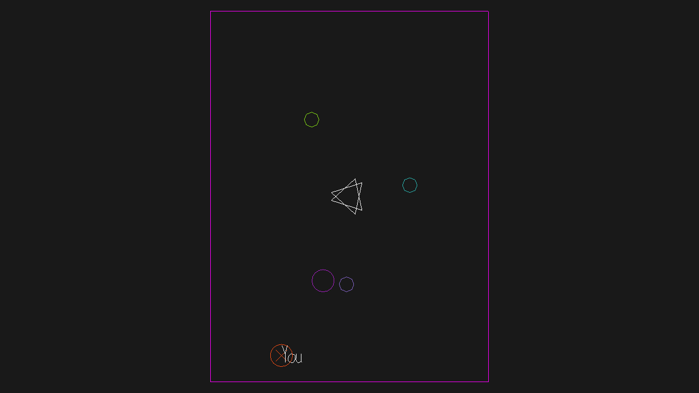

# Defenders

Author: Joyce Zhang

Design: Defend the sacred energy source from octagon space invaders! Although you alone have the energy to knock them back, you have to collaborate with your peer to eliminate them through the energy beam you conjure between!

Networking: The game builds on the current multiplayer framework. In addition to the player position, the current game also syncs up the enemy position, game state (is the game over), and if both players are in "attack" mode. The code structure relies on both players uploading their inputs to the server, where most updates and checks are carries out. The server writes info back the player, where they're expected to update the drawing display. For more details, see ``Game.cpp``, in ``update`` and ``send\receive_state_message``.

Screen Shot:

How To Play:
WASD to move. Press space to activate the energy beam. The beam only appears when **both** player press down space. While the beam is activated, both players take a movement speed cut. Use the beam to kill enemies. 

Sources: the base code taken from CGP!

This game was built with [NEST](NEST.md).

